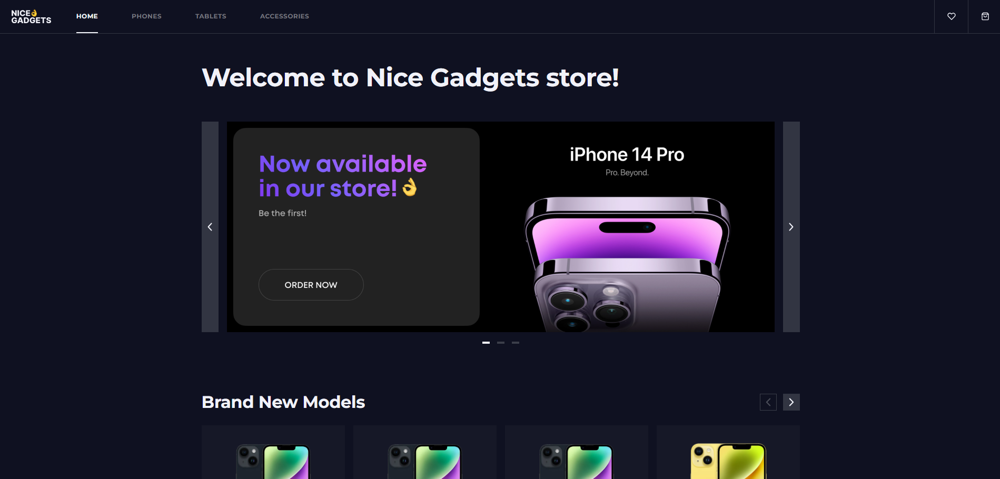

📸 Screenshot

- 

---

🌐 Demo

- [DEMO LINK](https://Uusuff.github.io/react-apple-store/)

---

# React Phone Catalog

A React-based **phone catalog** showcasing Apple devices (iPhone, iPad, Apple Watch).
This project is a responsive product listing / landing/catalog app with browsing, filtering and product details — ideal as a shop landing or demo catalog.

---

## 🚀 Features

- Responsive product catalog (iPhone, iPad, Apple Watch)
- Filtering and search
- Product details view
- Favorites and cart stored in **localStorage**
- Sorting (price, novelty, rating)
- Connected mock API
- Pagination and infinite scroll
- Tests (Jest + React Testing Library)
- Improved accessibility (ARIA, focus management)
- Smooth animations and interactions
- Deployed on **GitHub Pages**

---

## 🧩 Tech Stack

- React (functional components + hooks)
- CSS / SCSS (project styles)
- Optional: React Router (for routing between list / details)
- Bundler: your project setup Vite

---

## 📁 Project Structure

```
src/
├── api/        # API logic (fetch, client, mock-API requests)
├── assets/     # static assets (images, icons)
├── components/ # reusable React components (Catalog, ui, ProdactCard, etc.)
├── modules/    # feature modules or large functional blocks (e.g., Footer, Header, ProductInfo)
├── pages/      # page-level components that combine modules and components
├── router/     # routing (react-router)
├── shared/     # context, hooks, variables, utils, types, mixins
├── styles/     # reset styles
├── App.tsx     # root application component
└── main.tsx    # entry point (ReactDOM.createRoot, renders App)

```

---

## 💻 Installation & Local Run

1. Clone the repo:

```

git clone https://github.com/Uusuff/react_phone-catalog.git

```

2. Install dependencies:

```

cd react_phone-catalog
npm install

```

3. Start development server:

```
npm start

```

---
